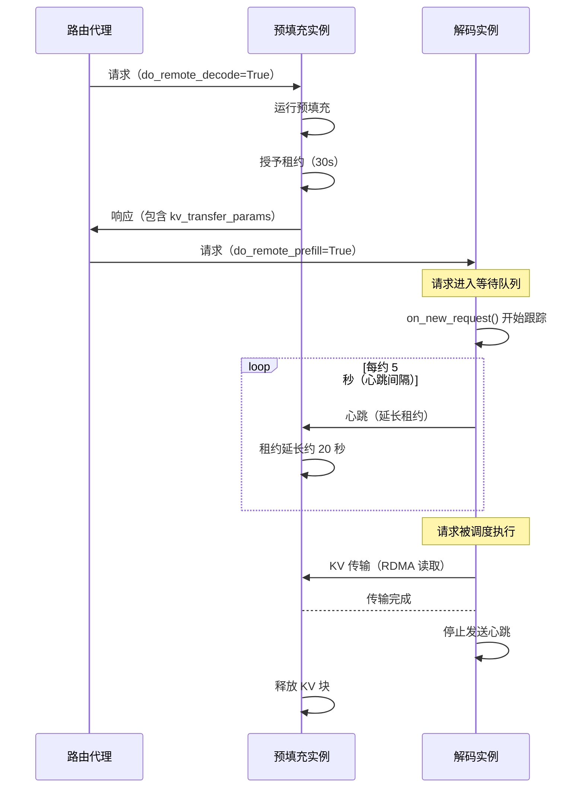
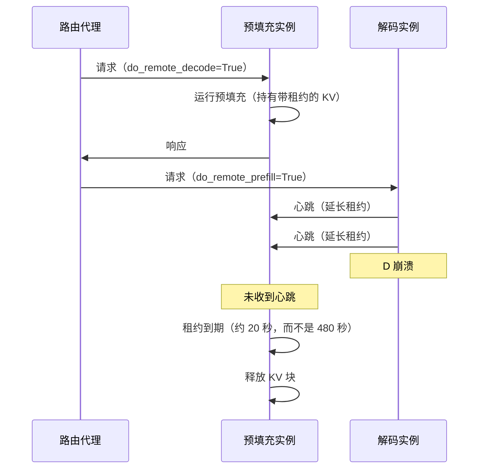

# NIXL KV Cache 租约续期

在分离式预填充/解码部署中，预填充实例（P）在完成预填充后必须将 KV cache 块保留在 GPU 内存中，等待解码实例（D）通过 RDMA 读取它们。需要一种机制来确定当 D 无法检索这些块时，何时可以安全地释放它们。该机制在 [PR #41383](https://github.com/vllm-project/vllm/pull/41383) 中引入。

## 动机

### 单一超时问题

原始设计使用单一的、较大的超时时间（`VLLM_NIXL_ABORT_REQUEST_TIMEOUT`，默认 480 秒）来控制 P 保留 KV 块的时间。当 D 崩溃或断开连接时，P 会持有可能数 GB 的"死"块长达 8 分钟才能回收。在此窗口期间，后续到达 P 的请求会发现缓存容量减少，性能下降。

### 过载问题

仅仅降低超时时间会引入另一种故障模式。在流量激增的情况下，请求可能在 D 的等待队列中停留很长时间才能被调度。如果 P 上的固定超时时间太短，块会在 D 有机会读取之前就被释放——导致不必要的重新计算和浪费的预填充工作。

### 解决方案：通过心跳进行租约续期

租约续期机制同时解决了这两个问题。P 在预填充完成时授予一个**短初始租约**（默认 30 秒）。当请求在 D 上**排队或正在处理**时，D **定期向 P 发送心跳**以延长租约。如果 D 崩溃并停止发送心跳，P 会在最后一次心跳后的几秒钟内回收块，而不是等待几分钟。如果 D 仅仅是过载，心跳会按需保持块存活。

## 工作原理

### 租约生命周期

当 P 完成预填充时，它会以初始租约持续时间（`kv_lease_duration`，默认 30 秒）固定 KV 块。从那时起，这些块将一直持有，直到以下情况之一发生：

1. **D 完成 KV 传输** —— P 收到读取完成通知并立即释放块。
2. **D 持续发送心跳** —— 每次心跳将租约延长 `lease_duration * 2/3`（约 20 秒），使块在 D 健康时无限期保持存活。
3. **没有心跳到达** —— 租约到期，P 回收块。

### 捎带 NIXL 通知

心跳复用 NIXL 现有的通知系统（`send_notif` / `get_new_notifs`），而不是引入新的传输通道。通知介质是后端特定的，从 IB/RoCE 到 TCP 的自动回退已由 NIXL 处理。从 D 发送到特定 P 的每条单次心跳消息都会更新 P 上为该 D 固定的所有请求的租约——换句话说，每次迭代的一条批量消息即可续期多个请求的租约。

### 调度器端跟踪（D）

一个关键的见解是，心跳必须在请求**进入 D 的调度器**时就开始——而不是在它被调度执行时才开始。在重负载下，请求可能在等待队列中停留的时间远远超过初始租约持续时间，而到达和调度之间的时间间隔是无界的。

为了实现这一点，D 的连接器（`NixlConnectorScheduler`）通过 `on_new_request()` 挂接到调度器。当具有 `do_remote_prefill=True` 的请求到达时，连接器立即开始跟踪它以便发送心跳。请求按 `remote_engine_id` 分组以实现高效批处理。在每个调度器步骤中，心跳元数据被打包到 `NixlConnectorMetadata` 中并发送给工作器，通过 `lease_duration // 6`（约 5 秒）的心跳间隔进行限流。

当 KV 传输完成（通过 `update_connector_output`）或请求完成/中止（通过 `request_finished`）时，跟踪停止。

### 时机与简洁性

心跳的发送和处理发生在**前向循环中**，而不是在后台线程中。这意味着时机不是毫秒级精确的——长时间模型的 forward 前向传播会延迟心跳。然而，租约持续时间配置了足够的余量：使用默认设置，心跳间隔（约 5 秒）和租约延长（约 20 秒）至少比典型的前向传播大一个数量级。这避免了线程间的锁复杂性，同时保持了设计的简洁性和可扩展性。

## 正常路径



## 解码实例崩溃



### 工作器端发送和接收

**在 D 端（发送）：** 在 `start_load_kv()` 期间（每次前向传播时调用），工作器读取 `metadata.heartbeat_by_engine` 并向每个远程 P 引擎发送批量心跳通知。如果 D 尚未与特定引擎的 P 建立握手（对于仍在等待队列中的请求很常见），它会在后台线程中触发一次**主动握手**。
一旦握手完成，心跳将推迟到下一步——早期握手也**加速了最终的 KV 传输**。

**在 P 端（接收）：** 在 `_get_new_notifs()` 中，P 的工作器检查传入的 NIXL 通知。以 `"HB:"` 开头的消息被路由到 `_handle_heartbeat()`，该函数使用 `max(old_expiry, now + lease_extension)` 为每个引用的请求延长租约到期时间。这确保了租约永远不会被意外缩短。

## 双向 KV 传输

对于多轮对话，[双向 KV 传输](../features/disagg_prefill.md)允许 D 缓存 KV 块，以便 P 在后续轮次中从中拉取。由于下一轮对话的时机是**客户端决定的**（不受系统控制），基于心跳的租约机制在这里不适用。相反，一个单独的 `decoder_kv_blocks_ttl`（默认 480 秒）为 D 上缓存的块提供了一个简单的固定超时时间。如果客户端过长时间未继续对话，块到期，P 将重新计算。未来的工作可能会将对称的心跳机制扩展到这种情况。

## 关键设计决策

- **按请求租约，而非按实例。** P 不知道它的 KV 块属于哪个 D——块的所有权只有在预填充完成且路由器选择一个 D 后才确定。在请求级别进行租约避免了负载均衡器中 P/D 选择的耦合。实际上，D 通过将具有相同 `remote_engine_id` 的请求分组，将租约续期批量发送到同一个 P。

- **以 NIXL 通知作为传输方式。** 心跳复用了现有的 `send_notif` / `get_new_notifs` 系统，而不是添加 ZMQ 连接或 API 更改。通知介质是后端特定的，IB/RoCE 到 TCP 的回退已处理，使心跳能在任何 NIXL 支持的传输上工作。

- **无后台线程。** 心跳的发送和处理发生在前向循环中（`start_load_kv` / `get_finished`）。这避免了线程间的锁复杂性。租约持续时间相对于前向传播延迟提供了足够的余量（秒级对比毫秒级）。

- **主动握手。** 当 D 需要向尚未连接的 P 引擎发送心跳时（对于仍在等待队列中的请求很常见），它会在后台线程中触发早期握手。这也加速了最终的 KV 传输。

- **异构 TP 支持。** 当 P TP > D TP（例如 P TP=4、D TP=2）时，单个 D 工作器从多个 P 工作器拉取数据。必须向给定引擎的所有 P 工作器发送心跳。相反，当 D TP > P TP 时，单个 P 接收来自多个 D 的通知，这只会多次刷新 TTL，没有负面影响。

## 配置

租约机制通过 `--kv-transfer-config` 中的 `kv_connector_extra_config` 控制：

| 参数 | 默认值 | 描述 |
|-------------------------|---------|---------------------------------------------------------------------------------------------------------------------------------------------------------------|
| `kv_lease_duration` | 30s | P 上的初始租约持续时间。心跳间隔和续期量自动推导（`interval = duration // 6`，`extension = duration * 2 // 3`）。 |
| `decoder_kv_blocks_ttl` | 480s | 双向传输模式下 D 上缓存的 KV 块的 TTL。简单的固定超时，不通过心跳续期。 |

```bash
vllm serve <MODEL> \
  --kv-transfer-config '{
    "kv_connector": "NixlConnector",
    "kv_role": "kv_both",
    "kv_connector_extra_config": {"kv_lease_duration": 60}
  }'
```

有关 NixlConnector 配置的完整详情，请参见 [NixlConnector 使用指南](../features/nixl_connector_usage.md)。
