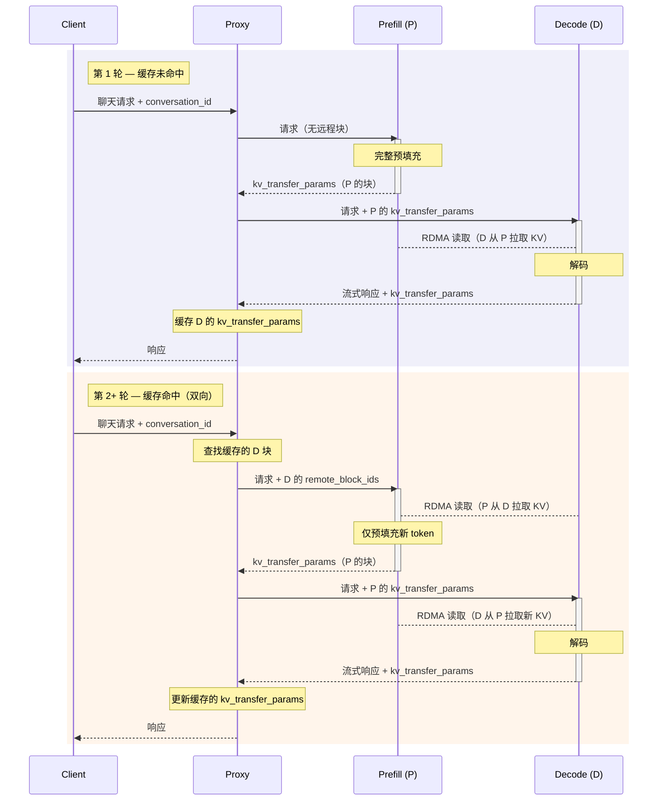

# NixlConnector 使用指南

NixlConnector 是 vLLM 分离式预填充功能的高性能 KV 缓存传输连接器。它使用 NIXL 库提供完全异步的发送/接收操作，实现高效的跨进程 KV 缓存传输。

有关功能兼容性详情（支持的模型架构、TP 配置和功能交互），请参阅 [NixlConnector 兼容性矩阵](nixl_connector_compatibility.md)。

## 前提条件

### 安装

安装 NIXL 库：`uv pip install nixl`，适用于 NVIDIA 平台的快速入门。

- 更多安装说明请参考 [NIXL 官方仓库](https://github.com/ai-dynamo/nixl)
- 所需的 NIXL 版本可在 [requirements/kv_connectors.txt](../../requirements/kv_connectors.txt) 和其他相关配置文件中找到

对于 ROCm 平台，[ROCm Docker 文件](../../docker/Dockerfile.rocm)已包含 RIXL 和 ucx。

- 更多信息请参考 [RIXL 官方仓库](https://github.com/rocm/rixl)
- RIXL 的支撑库可在 [requirements/kv_connectors_rocm.txt](../../requirements/kv_connectors_rocm.txt) 中找到
- 未来我们可能从 Docker 镜像文件中移除 RIXL，用户将能够从预编译的二进制包中安装

对于非 CUDA 平台，请按以下说明从源码安装带有 ucx 构建的 nixl。

```bash
python tools/install_nixl_from_source_ubuntu.py
```

### 传输配置

NixlConnector 使用 NIXL 库进行底层通信，该库支持多种传输后端。UCX（Unified Communication X）是 NIXL 使用的主要默认传输库。配置传输环境变量：

```bash
# UCX 配置示例，请根据您的环境调整
export UCX_TLS=all  # 或指定特定传输，如 "rc,ud,sm,^cuda_ipc" 等
export UCX_NET_DEVICES=all  # 或指定网络设备，如 "mlx5_0:1,mlx5_1:1"
```

!!! tip
    使用 UCX 作为传输后端时，NCCL 环境变量（如 `NCCL_IB_HCA`、`NCCL_SOCKET_IFNAME`）不适用于 NixlConnector，因此请配置 UCX 特定的环境变量而非 NCCL 变量。

#### 选择 NIXL 传输后端（插件）

NixlConnector 可以使用不同的 NIXL 传输后端（插件）。默认情况下，NixlConnector 使用 UCX 作为传输后端。

要选择不同的后端，请在 `--kv-transfer-config` 中设置 `kv_connector_extra_config.backends`。

### 示例：使用 LIBFABRIC 后端

```bash
vllm serve <MODEL> \
  --kv-transfer-config '{
    "kv_connector":"NixlConnector",
    "kv_role":"kv_both",
    "kv_connector_extra_config":{"backends":["LIBFABRIC"]}
  }'
```

您也可以使用点分隔参数单独传递 JSON 键，并使用 `+` 附加列表元素：

```bash
vllm serve <MODEL> \
  --kv-transfer-config.kv_connector NixlConnector \
  --kv-transfer-config.kv_role kv_both \
  --kv-transfer-config.kv_connector_extra_config.backends+ LIBFABRIC
```

!!! note
    后端可用性取决于 NIXL 的构建方式以及您的环境中存在哪些插件。请参考 [NIXL 仓库](https://github.com/ai-dynamo/nixl)了解可用的后端和构建说明。

## 基本用法（同一主机上）

### 生产者（预填充器）配置

启动生成 KV 缓存的预填充器实例

```bash
# 第一个 GPU 作为预填充器
CUDA_VISIBLE_DEVICES=0 \
UCX_NET_DEVICES=all \
VLLM_NIXL_SIDE_CHANNEL_PORT=5600 \
vllm serve Qwen/Qwen3-0.6B \
  --port 8100 \
  --enforce-eager \
  --kv-transfer-config '{"kv_connector":"NixlConnector","kv_role":"kv_both","kv_load_failure_policy":"fail"}'
```

### 消费者（解码器）配置

启动消费 KV 缓存的解码器实例：

```bash
# 第二个 GPU 作为解码器
CUDA_VISIBLE_DEVICES=1 \
UCX_NET_DEVICES=all \
VLLM_NIXL_SIDE_CHANNEL_PORT=5601 \
vllm serve Qwen/Qwen3-0.6B \
  --port 8200 \
  --enforce-eager \
  --kv-transfer-config '{"kv_connector":"NixlConnector","kv_role":"kv_both","kv_load_failure_policy":"fail"}'
```

### 代理服务器

使用代理服务器在预填充器和解码器之间路由请求：

```bash
python tests/v1/kv_connector/nixl_integration/toy_proxy_server.py \
  --port 8192 \
  --prefiller-hosts localhost \
  --prefiller-ports 8100 \
  --decoder-hosts localhost \
  --decoder-ports 8200
```

## 环境变量

- `VLLM_NIXL_SIDE_CHANNEL_PORT`：NIXL 握手通信端口
    - 默认值：5600
    - **预填充器和解码器实例都需要**
    - 每个 vLLM 工作进程在其主机上需要唯一的端口；在不同主机上使用相同的端口号没有问题
    - 对于 TP/DP 部署，节点上每个工作进程的端口计算方式为：base_port + dp_rank（例如，`--data-parallel-size=2` 且 base_port=5600 时，dp_rank 0..1 在该节点上分别使用端口 5600、5601）。
    - 用于预填充器和解码器之间的初始 NIXL 握手

- `VLLM_NIXL_SIDE_CHANNEL_HOST`：侧通道通信主机
    - 默认值："localhost"
    - 当预填充器和解码器位于不同机器上时设置
    - 连接信息通过 KVTransferParams 从预填充器传递到解码器进行握手

- `kv_lease_duration`（通过 `kv_connector_extra_config`）：预填充器的 KV 缓存块租约持续时间（秒）。（可选）
    - 默认值：30
    - 当预填充请求完成时，其 KV 块将在此持续时间内保留，等待解码器读取。当请求在解码器上排队时，定期心跳会自动延长租约。如果在租约到期前既未收到心跳也未收到读取通知，则释放这些块。心跳间隔和延长时间会自动从此值派生。
    - 示例：`--kv-transfer-config '{"kv_connector_extra_config": {"kv_lease_duration": 60}}'`

- `decoder_kv_blocks_ttl`（通过 `kv_connector_extra_config`）：双向传输模式下解码器上缓存的 KV 块的 TTL（秒）。（可选）
    - 默认值：480
    - 在双向模式下，解码器会缓存 KV 块以支持多轮对话。此 TTL 控制这些块在被释放前保留的时间。与预填充器租约不同，此 TTL 不会通过心跳续期。
    - 示例：`--kv-transfer-config '{"kv_connector_extra_config": {"decoder_kv_blocks_ttl": 600}}'`

## 双向 KV 传输（多轮）

在标准的分离式预填充中，KV 缓存沿一个方向流动：预填充（P）计算 KV 缓存，解码（D）从 P 读取。对于多轮对话，这是浪费的——D 已经持有先前轮次生成的 token 对应的 KV 缓存，但 P 必须在每一轮从头重新计算。双向 KV 传输允许 P 通过 RDMA 从 D **拉取**现有的 KV 块，然后仅计算新的 token，从而显著减少**多轮繁重场景**等长预填充场景的首 token 时间（TTFT）。

### 工作原理

此功能依赖于一个**有状态代理**，它位于客户端和 P/D 实例之间。代理跟踪 D 在每轮结束时返回的 `kv_transfer_params`，并将其附加到下一轮的请求中，以便 P 知道从 D 拉取哪些块。



**第 1 轮（缓存未命中）：**

1. 客户端向代理发送带有 `conversation_id` 的聊天请求。
2. 代理将请求转发给 P，不包含远程块信息——P 计算完整的 KV 缓存。
3. 代理将请求与 P 的 `kv_transfer_params`（块 ID、引擎 ID、主机/端口）一起转发给 D。
4. D 通过 RDMA 从 P 读取 KV 块（点对点拉取），然后生成响应。
5. D 通过代理将响应流式传回。最后一个块包含 D 自己的 `kv_transfer_params`。
6. 代理以 `conversation_id` 为键缓存 D 的 `kv_transfer_params`，然后将响应返回给客户端。

**第 2+ 轮（缓存命中——双向）：**

1. 客户端使用相同的 `conversation_id` 发送下一轮。
2. 代理查找缓存的 `kv_transfer_params`，并将 D 的 `remote_block_ids` 附加到发送给 P 的请求中。
3. P 通过 RDMA（D→P 拉取）从 D 读取现有 KV 缓存，然后仅计算新 token 的 KV。
4. 代理将请求连同 P 更新的 `kv_transfer_params` 转发给 D。
5. D 从 P 读取新的 KV 块，生成响应，并返回更新的 `kv_transfer_params`，代理将其缓存以供下一轮使用。

### 配置

通过在 **P 和 D 实例上**的 `kv_connector_extra_config` 中设置 `bidirectional_kv_xfer` 来启用双向 KV 传输：

```bash
vllm serve <MODEL> \
  --kv-transfer-config '{
    "kv_connector": "NixlConnector",
    "kv_role": "kv_both",
    "kv_connector_extra_config": {
      "bidirectional_kv_xfer": true
    }
  }'
```

`kv_connector_extra_config` 中的其他配置选项：

| 参数 | 默认值 | 描述 |
| --------- | ------- | ----------- |
| `bidirectional_kv_xfer` | `false` | 启用双向 D→P KV 传输。 |
| `kv_recompute_threshold` | `64` | 触发 D→P 拉取所需的最小远程 token 数量。低于此阈值时，P 在本地重新计算而不是拉取（以分摊传输延迟）。 |
| `decoder_kv_blocks_ttl` | `480` | D 上缓存的 KV 块的 TTL（秒），用于双向重用。在此持续时间后释放块。不通过心跳续期。 |

### 多轮代理设置

使用提供的多轮代理来跨对话轮次管理 `kv_transfer_params` 缓存：

```bash
python examples/disaggregated/disaggregated_serving/disagg_proxy_multiturn.py \
  --host 0.0.0.0 --port 8000 \
  --prefiller-host <P_IP> --prefiller-port 8100 \
  --decoder-host <D_IP> --decoder-port 8200
```

代理支持通过轮询调度（round-robin）方式使用多个 P 和 D 实例：

```bash
python examples/disaggregated/disaggregated_serving/disagg_proxy_multiturn.py \
  --host 0.0.0.0 --port 8000 \
  --prefiller-hosts <P_IP1> <P_IP2> --prefiller-ports 8100 8100 \
  --decoder-hosts <D_IP1> <D_IP2> --decoder-ports 8200 8200
```

### 客户端使用

在请求体中包含 `conversation_id` 字段以启用跨轮 KV 重用。如果没有它，代理无法关联各轮，将回退到完全重新计算。

```bash
# 第 1 轮
curl http://localhost:8000/v1/chat/completions \
  -H "Content-Type: application/json" \
  -d '{
    "model": "Qwen/Qwen3-0.6B",
    "conversation_id": "session-42",
    "messages": [
      {"role": "user", "content": "What is vLLM?"}
    ]
  }'

# 第 2 轮 — 相同的 conversation_id 触发双向 KV 拉取
curl http://localhost:8000/v1/chat/completions \
  -H "Content-Type: application/json" \
  -d '{
    "model": "Qwen/Qwen3-0.6B",
    "conversation_id": "session-42",
    "messages": [
      {"role": "user", "content": "What is vLLM?"},
      {"role": "assistant", "content": "vLLM is a high-throughput LLM serving engine..."},
      {"role": "user", "content": "How does disaggregated prefilling work?"}
    ]
  }'
```

!!! note
    `conversation_id` 字段是 OpenAI API 的非标准扩展。它由代理消费，不会转发到 vLLM 引擎。

### 限制

- 需要有状态代理（或等效路由器）来跟踪和转发轮次间的 `kv_transfer_params`。
- 目前在具有设备缓冲区 KV 缓存的 CUDA 上受支持。主机缓冲区支持（例如，用于 Intel XPU）计划在未来工作中实现。

!!! warning "带有剥离思考痕迹的推理模型"
    使用生成思考痕迹（`<think>...</think>`）的推理模型（如 DeepSeek-R1）时，D 的 KV 块覆盖包括思考 token 在内的完整 token 序列。如果客户端在发送下一轮之前从对话历史中剥离思考痕迹，P 收到的提示将缺少 D 生成内容中间的 token。块对齐逻辑假设 P 的提示是 D 序列的前缀，因此在这种情况下从 D 拉取 KV 块会传输为错误 token 位置计算的缓存，产生不正确的结果。

    我们目前假设路由器能够检测到这种跨轮不匹配。请参见 [#43094](https://github.com/vllm-project/vllm/issues/43094)。

## 多实例设置

### 不同机器上的多个预填充器实例

```bash
# 机器 A 上的预填充器 1（示例 IP：${IP1}）
VLLM_NIXL_SIDE_CHANNEL_HOST=${IP1} \
VLLM_NIXL_SIDE_CHANNEL_PORT=5600 \
UCX_NET_DEVICES=all \
vllm serve Qwen/Qwen3-0.6B --port 8000 \
  --tensor-parallel-size 8 \
  --kv-transfer-config '{"kv_connector":"NixlConnector","kv_role":"kv_producer","kv_load_failure_policy":"fail"}'

# 机器 B 上的预填充器 2（示例 IP：${IP2}）
VLLM_NIXL_SIDE_CHANNEL_HOST=${IP2} \
VLLM_NIXL_SIDE_CHANNEL_PORT=5600 \
UCX_NET_DEVICES=all \
vllm serve Qwen/Qwen3-0.6B --port 8000 \
  --tensor-parallel-size 8 \
  --kv-transfer-config '{"kv_connector":"NixlConnector","kv_role":"kv_producer","kv_load_failure_policy":"fail"}'
```

### 不同机器上的多个解码器实例

```bash
# 机器 C 上的解码器 1（示例 IP：${IP3}）
VLLM_NIXL_SIDE_CHANNEL_HOST=${IP3} \
VLLM_NIXL_SIDE_CHANNEL_PORT=5600 \
UCX_NET_DEVICES=all \
vllm serve Qwen/Qwen3-0.6B --port 8000 \
  --tensor-parallel-size 8 \
  --kv-transfer-config '{"kv_connector":"NixlConnector","kv_role":"kv_consumer","kv_load_failure_policy":"fail"}'

# 机器 D 上的解码器 2（示例 IP：${IP4}）
VLLM_NIXL_SIDE_CHANNEL_HOST=${IP4} \
VLLM_NIXL_SIDE_CHANNEL_PORT=5600 \
UCX_NET_DEVICES=all \
vllm serve Qwen/Qwen3-0.6B --port 8000 \
  --tensor-parallel-size 8 \
  --kv-transfer-config '{"kv_connector":"NixlConnector","kv_role":"kv_consumer","kv_load_failure_policy":"fail"}'
```

### 多个实例的代理

```bash
python tests/v1/kv_connector/nixl_integration/toy_proxy_server.py \
  --port 8192 \
  --prefiller-hosts ${IP1} ${IP2} \
  --prefiller-ports 8000 8000 \
  --decoder-hosts ${IP3} ${IP4} \
  --decoder-ports 8000 8000
```

对于多主机 DP 部署，只需提供头节点实例的主机/端口。

### KV 角色选项

- **kv_producer**：用于生成 KV 缓存的预填充器实例
- **kv_consumer**：从预填充器消费 KV 缓存的解码器实例
- **kv_both**：启用对称功能，连接器可以同时充当生产者和消费者。这为实验性设置和角色区分未预定的场景提供了灵活性。

!!! tip
    NixlConnector 目前不区分 `kv_role`；实际的预填充器/解码器角色由上层代理决定（例如，`toy_proxy_server.py` 使用 `--prefiller-hosts` 和 `--decoder-hosts`）。
    因此，`--kv-transfer-config` 中的 `kv_role` 实际上是一个占位符，不影响 NixlConnector 的行为。

### KV 加载失败策略

`kv_load_failure_policy` 设置控制解码器实例从预填充器实例加载 KV 缓存块失败时的处理方式：

- **fail**（默认）：KV 加载失败时立即失败请求并返回错误。这通过在解码实例上避免重新计算预填充工作来防止性能下降。
- **recompute**：在解码实例上本地重新计算失败的块。这可能导致解码实例上的性能抖动，因为调度的预填充将延迟并干扰其他解码。此外，解码实例通常配置了低延迟优化。

!!! warning
    使用 `kv_load_failure_policy="recompute"` 可能导致生产部署中的性能下降。当 KV 加载失败时，解码实例将使用解码优化配置执行预填充工作，这效率低下且违背了分离式预填充的目的。这还会增加其他正在进行的解码请求的尾部延迟。

### 针对 NVIDIA GB 系列 GPU

GB 系列 GPU 支持多节点 NVLink。NIXL 支持此功能，但 KVCache 在 KVCache 注册期间必须注册为 VMM。要启用此功能，您需要设置 `--enable-cumem-allocator` 或 `--enable-sleep-mode` 标志，并设置 `UCX_CUDA_IPC_ENABLE_MNNVL: 'y'` 环境变量。否则，NIXL 只能使用 RDMA/TCP 进行跨节点 KVCache 传输。

## 实验性功能

### 异构 KV 布局支持

支持用例：使用 'HND' 进行预填充和使用 'NHD' 进行解码的实验配置

```bash
--kv-transfer-config '{..., "enable_permute_local_kv":"True"}'
```

### 跨层块

默认情况下，此功能为禁用状态。在支持此功能的注意力后端上，每个逻辑块在物理内存中是连续的。这减少了需要传输的缓冲区数量。
要启用此功能：

```bash
--kv-transfer-config '{..., "kv_connector_extra_config": {"enable_cross_layers_blocks": "True"}}'
```

## 示例脚本/代码

请参考 vLLM 仓库中的以下示例脚本：

- [run_accuracy_test.sh](../../tests/v1/kv_connector/nixl_integration/run_accuracy_test.sh)
- [toy_proxy_server.py](../../tests/v1/kv_connector/nixl_integration/toy_proxy_server.py)
- [test_accuracy.py](../../tests/v1/kv_connector/nixl_integration/test_accuracy.py)
